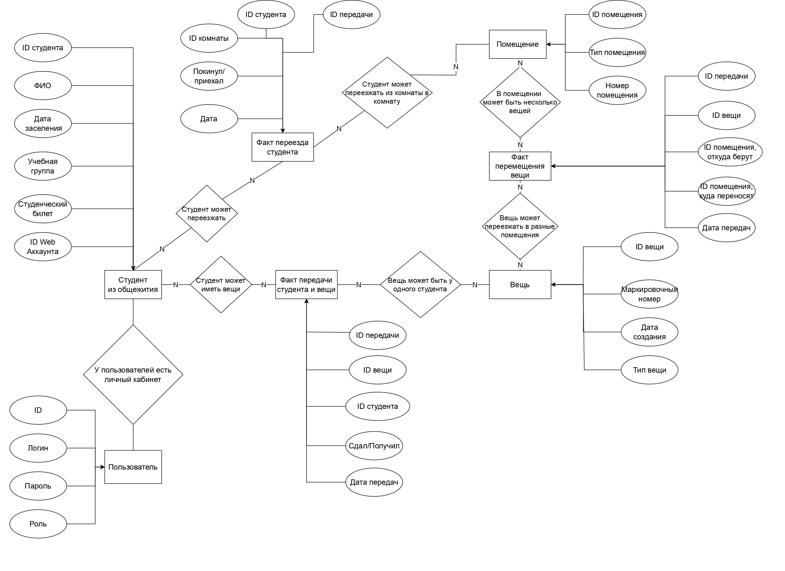

# БауманУчёт

## Краткое описание идеи проекта
В общежитии №5 МГТУ им. Баумана до сих пор используется бумажная база данных по поводу учёта бытовых вещей, выданных студентам (например, стул, стол, кровать). Из-за этого при желании студента поменять новый предмет приходится искать карточку в куче других, где ещё и к тому же есть студенты, которые были не выселены. Более того, карточка может быть случайно утеряна, и решать вопрос с комендантом не очень приятно. Иногда техника вроде холодильника остаётся в комнате после выселения одного из студентов, и спустя некоторое время возникает путаница. Поэтому моя идея - сделать электронный вариант БД, где учитывается, какой студент что взял и что вернул.

## Краткое описание предметной области
Студенты при заселении в общежитие получают необходимую бытовую технику в пользование. Студент живёт в определённой комнате, обучается в определённой группе, имеет ФИО и какие-то студенческие документы (студак, зачётка). Бытовая техника имеет уникальный номер маркировки, а также определённый тип - то есть тумбочку можно обменять только на тумбочку. У студента может быть много техники, которую впоследствии надо вернуть, но есть ограничения: например, не больше одной кровати на проживающего. Техника закреплена за студентом, то есть холодильник закреплён за одним человеком. Студенты в течение проживания могут в любой момент поменять технику на новую, если то, что ему требуется, есть на общем складе. Делами заселения и выселения студентом занимается комендант, добавления и удаления техники со склада и выдача студентам - завхоз.

## Краткий обзор существующих решений
Аналогов приложений, имеющих специфику общежития, не обнаружено.

## Краткое обоснование целесообразности и актуальности проекта
Актуальность проекта заключается в том, что общежитие до сих пор пользуется бумажной базой данных, но из-за этого часто возникают сложности. Автору пришлось столкнуться с бюрократическими проблемами при смене тумбочки. Целесообразность проекта заключается в том, что электронная БД отвечает требованиям безопасности (карточка не может быть утеряна или испорчена), долговечности, надёжности и простоты использования.

## Use-Case - диаграмма

## ER-диаграмма сущностей

## Архитектурные характеристики
1. Надёжность
2. Консистентность данных
3. Отказоустойчивость
4. Масштабируемость
